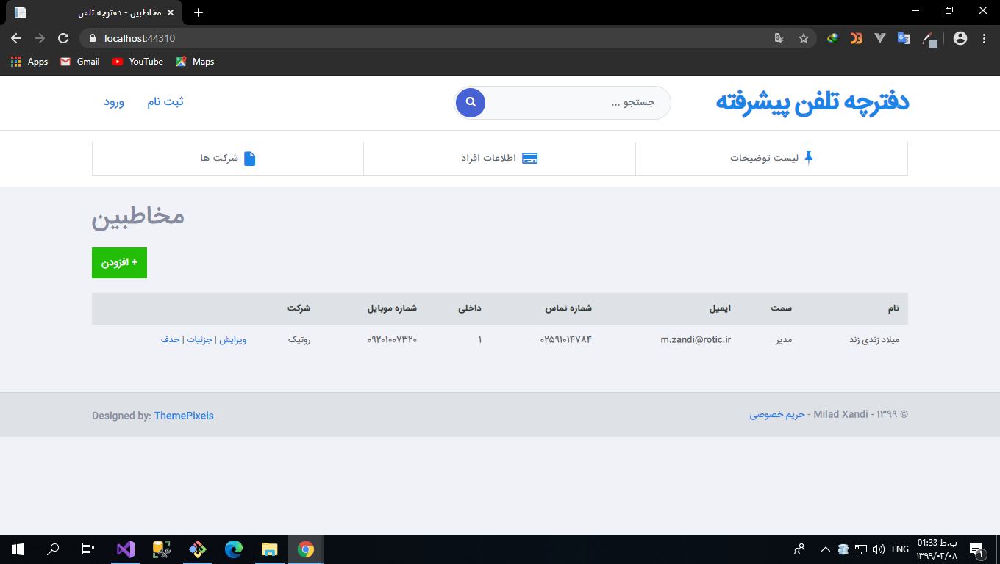

# Advanced Phonebook




## This project is based on ASP.NET Core 3.1 and Entity Framework 6

You may need to organize your contacts, calls and customer brands better with an online tools. This project with an internal DB will help you for this experience.

## How to run?

Anything you may need is in the project, but if there was any error with this, you can run one of these boxes commands.

On Package Manager Console:

```
PM> Update-Database

PM> Scaffold-DbContext "DataSource=app.db" Microsoft.EntityFrameworkCore.Sqlite -OutputDir Models
```

Or run this one on an EF6 installed terminal:

```
dotnet ef database update

dotnet ef dbcontext scaffold "DataSource=app.db" Microsoft.EntityFrameworkCore.Sqlite -OutputDir Models 
```

Let me know about the issus:

[Website](https://miladzandi.ir) - [Email](info@miladzandi.ir) 